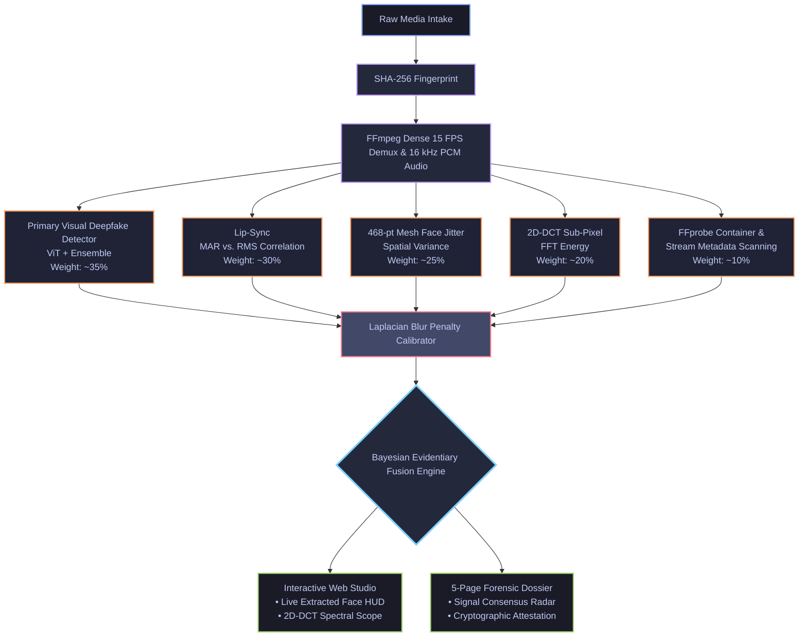

# ⚡ DECEPTRIX — Explainable Multi-Modal AI Forensic Intelligence Platform

> **Problem Category: AI Forensics & Information Integrity**  
> *"Evidence Before Conclusions"* — Next-generation multi-modal deepfake detection and claim verification engine producing court-admissible forensic intelligence dossiers.

---

## 🎯 Executive Overview

**DECEPTRIX** is an enterprise-grade AI forensic intelligence platform designed for law enforcement, investigative journalism, content moderation platforms, and cybersecurity laboratories. 

While legacy deepfake detectors act as "black boxes" that return arbitrary percentages without context, DECEPTRIX performs **dense multi-modal forensic decomposition** across 5 independent neural and statistical signal layers. These independent modalities are combined via a **Bayesian Evidentiary Fusion Engine**, which dynamically mitigates model hallucinations (e.g., motion blur false positives). The final output is an immutable, **cryptographically attestation-sealed 5-page forensic dossier** that can be presented as explainable evidence.

---

## 🏗️ System Architecture & Workflow

DECEPTRIX is built on a decoupled, highly scalable engine architecture, ensuring that visual, audio, temporal, and frequency models execute in complete isolation before their evidence is fused.



### 1. Data Ingestion & Demuxing
When media is uploaded to the FastAPI backend, the system immediately locks the file with a **SHA-256 cryptographic hash** to establish a strict chain of custody. **FFmpeg** is then utilized to demux the video—extracting visual frames at a dense 15 FPS and isolating the audio track into a 16 kHz PCM `.wav` file for precise temporal alignment.

### 2. The 5-Signal Forensic Engines
DECEPTRIX analyzes the media through five entirely distinct forensic lenses, preventing deepfakes that fool one modality from bypassing the system:

1. **Primary Visual Deepfake Detector (ViT-Patch16 & Ensemble):** 
   - *How it works:* Uses Vision Transformers (e.g., `dima806/deepfake_vs_real_image_detection` and `prithivMLmods`) to analyze patch-level self-attention textures.
   - *What it catches:* Generative neural network skin synthesis, boundary blending artifacts, and GAN upscaling residuals.
   - *Mitigation:* Backed by a **Laplacian Blur Variance Penalty** that dynamically suppresses hallucinated "fake" scores caused by heavy H.264 video compression or natural motion blur.

2. **Audio-Visual Lip Synchrony Correlation (Lip-Sync):**
   - *How it works:* Extracts the **Mouth Aspect Ratio (MAR)** using MediaPipe FaceMesh across every frame and correlates it with the acoustic **Root Mean Square (RMS)** energy envelope using Librosa.
   - *What it catches:* Audio-driven deepfakes (like Wav2Lip) or AI voice clones dubbed over real videos where the mouth movements mathematically desync from the audio energy.

3. **Facial Landmark Jitter Variance (Temporal Consistency):**
   - *How it works:* Tracks 468 biometric landmarks (inter-ocular distances, jawline angles) across consecutive frames to measure spatial variance.
   - *What it catches:* The subtle, high-frequency "flickering" or micro-morphing commonly seen in face-swap deepfakes (like Roop or InSwapper) which fail to maintain perfect temporal geometry.

4. **2D-DCT Spectral Frequency Analysis:**
   - *How it works:* Converts face crops from the spatial domain into the frequency domain using a Discrete Cosine Transform (DCT). It then calculates the high-frequency energy falloff.
   - *What it catches:* Synthetic AI models (especially older GANs) often leave a distinct, unnatural signature in the high-frequency spectrum that is invisible to the human eye but glaringly obvious in frequency analysis.

5. **Container & Stream Metadata Telemetry:**
   - *How it works:* Uses FFprobe to inspect codec profiles, missing creation dates, mismatched audio sample rates, and non-standard bitrates.
   - *What it catches:* Videos generated by cloud APIs or terminal scripts often strip metadata or use bizarre encoding profiles rarely seen in organic smartphone cameras.

### 3. Bayesian Evidentiary Fusion
Instead of a naive average, the `EvidenceFusionEngine` dynamically weights these signals based on confidence and correlation. For example, if the ViT visual score is wildly high, but the Lip-Sync is perfect and the Landmark Jitter is 0.00, the Bayesian engine will overrule the ViT hallucination, correctly classifying the video as `LIKELY AUTHENTIC` or `INCONCLUSIVE`. 

Conversely, if Lip-Sync deeply fails and visual anomalies are detected, the system asserts a `LIKELY MANIPULATED` classification with `HIGH` evidence quality.

---

## ✨ Core Platform Features

* **Interactive Web Studio Terminal:** Watch the backend pipeline execute in real-time through the UI. As frames are processed via Celery, the actual extracted face crops slide across a dynamic HUD ticker with neon cyber reticles.
* **Pluggable Engine Architecture:** All forensic layers live in `apps/api/services/forensics/` and `detectors/`, allowing researchers to easily hot-swap in new HuggingFace models or algorithmic checks without breaking the pipeline.
* **5-Page AI Forensic Intelligence Dossier (ReportLab):** Automatically generates a legally formatted, PDF export detailing the entire investigation.
  * **Page 1 — Executive Summary:** Threat classification, composite risk meter, and the primary evidentiary drivers.
  * **Page 2 — Forensic Signal Consensus:** Analytical breakdown of the 5 independent signal scores.
  * **Page 3 — Evidence Integrity & Telemetry:** 6-stage chain-of-custody timeline, full SHA-256 fingerprint, and stream telemetry grid.
  * **Page 4 — Visual Evidence & Biometrics:** High-resolution face crop cards embedding the exact frames that triggered the highest anomaly scores.
  * **Page 5 — Forensic Conclusion & Attestation:** Final ruling and an HMAC-SHA256 attestation seal to prove the report wasn't tampered with.
* **Rumour & Text Fact-Checking Pipeline:** Beyond video, DECEPTRIX features a multi-tier text verification engine. It decomposes complex claims atomically and queries them against a Tavily-powered hierarchy of trust (Tier 1: Gov/Fact-Checkers, Tier 2: Established News, Tier 3: General Web).

---

## 🛠️ Technology Stack

| Layer | Technologies |
|---|---|
| **Frontend UI** | Next.js 16 (App Router), TypeScript, Vanilla CSS Design System, Lucide Icons |
| **Backend API** | FastAPI, Python 3.10+, SQLAlchemy (SQLite/PostgreSQL), Celery |
| **AI & Forensics** | PyTorch, HuggingFace Transformers, MediaPipe, Librosa, OpenCV DNN, Scipy |
| **Document Generation** | ReportLab 4.x (TrueType Font Embedding: IBM Plex Sans & IBM Plex Mono) |
| **Container & Stream** | FFmpeg, FFprobe |

---

## 🚀 Quickstart Guide

### Prerequisites
* Python 3.10+
* Node.js 18+ & npm
* FFmpeg & FFprobe installed and available in `PATH`

### 1. Backend Setup
```bash
cd apps/api
python -m venv .venv
source .venv/bin/activate  # Or on Windows: .venv\Scripts\activate
pip install -r requirements.txt

# Start API Server (Runs in zero-dependency eager mode locally without needing Redis!)
CELERY_TASK_ALWAYS_EAGER=true uvicorn main:app --host 0.0.0.0 --port 8000 --reload
```
* API Health Check: `http://127.0.0.1:8000/health`
* Interactive OpenAPI Docs: `http://127.0.0.1:8000/docs`

### 2. Frontend Setup
```bash
cd apps/web
npm install
npm run dev
```
* Web Studio: `http://localhost:3000`
* Media Audit Studio: `http://localhost:3000/media`
* Rumour Fact-Checker: `http://localhost:3000/rumour`

---

## 📁 Repository Structure

```
DECEPTRIX/
├── apps/
│   ├── api/
│   │   ├── api/
│   │   │   ├── routes_media.py     # Media upload and polling endpoints
│   │   │   ├── routes_text.py      # Rumour text fact-checking endpoints
│   │   │   └── routes_reports.py   # ReportLab 5-page forensic dossier generator
│   │   ├── core/
│   │   │   ├── config.py           # Application settings
│   │   │   ├── database.py         # SQLAlchemy engine & session
│   │   │   └── celery_app.py       # Celery task queue configuration
│   │   ├── models/                 # ORM models and database schemas
│   │   ├── services/
│   │   │   ├── detectors/          # Pluggable visual models (ViT, etc.)
│   │   │   ├── forensics/          # Independent analysis engines:
│   │   │   │   ├── temporal.py     # Landmark jitter analysis
│   │   │   │   ├── frequency.py    # 2D-DCT spectral analysis
│   │   │   │   ├── lip_sync.py     # Audio-visual correlation
│   │   │   │   ├── metadata.py     # FFprobe stream telemetry
│   │   │   │   └── fusion.py       # Bayesian evidentiary fusion logic
│   │   │   ├── calibration/        # Laplacian Blur Variance Penalty
│   │   │   ├── media_worker.py     # Central orchestration worker
│   │   │   └── text_worker.py      # Multi-tier claim verification worker
│   │   └── main.py                 # FastAPI application root
│   └── web/
│       ├── src/
│       │   ├── app/                # Next.js App Router pages (/, /media, /rumour)
│       │   ├── components/         # MediaAudit, RumourAudit, AppShell, EvidenceCards
│       │   └── styles/             # globals.css (Dark mode design tokens)
│       └── package.json
└── README.md
```

---

## ⚖️ Forensic Scope & Disclaimers

DECEPTRIX is built on the principle of **explainable diagnostics**. Algorithmic assessments represent mathematical and neural evidence evaluations derived from specified model architectures and do not replace legal chain-of-custody protocols or human expert judgment.

---

## 👥 Contributors

*Repository:* [https://github.com/narain-karti/DECEPTRIX](https://github.com/narain-karti/DECEPTRIX)
